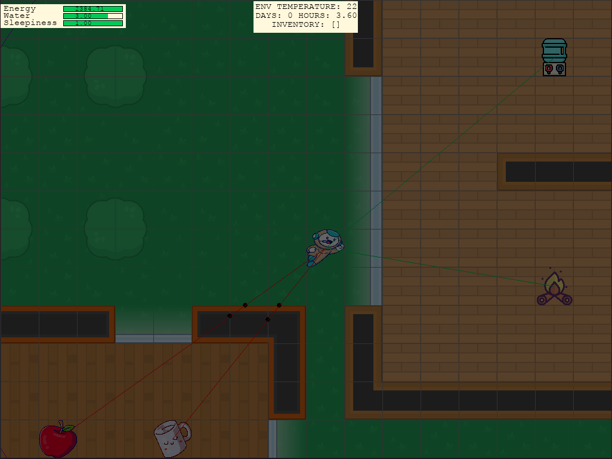
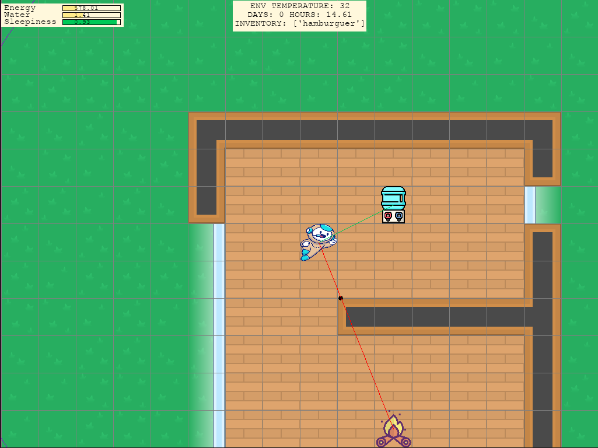
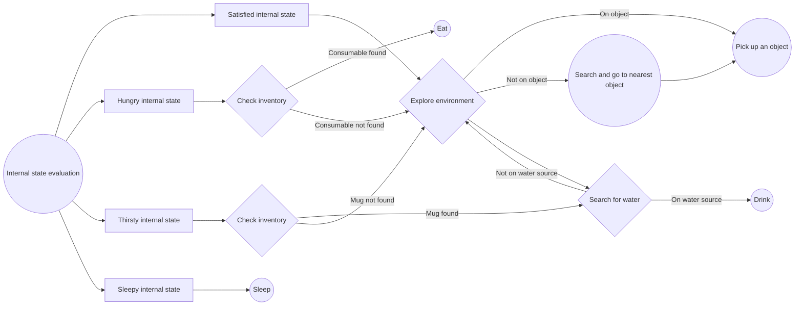

#

## Name of the project

AI-DRIVEN-AVATAR

## Description

This project is about the configuration of an human-like behavior avatar in a video game environment through reinforcement learning.

## Visuals

See it in action!

## Basic Usage

The code allows the execution of the algorithms under two modalities:

1) As an individual game instantiated in [Pygame](https://www.pygame.org/news).
2) As an adapted environment under the [Gym](https://www.gymlibrary.dev/) standard.

To execute the code in its first mode, all that is needed is to apply the following command: `python src/pygame`.

Within the second option, there are different arguments that modify the behaviour of the runtime:

- `python src/opengym -m` : It runs the normal operation of the environment adapted as an Gym environment in **manual** operation. Under this mode, information on the status, actions and rewards obtained by the user is provided.
- `python src/opengym -r` : It runs the normal operation of the environment adapted as an Gym environment in **random** operation. Under this mode, information on the status, actions and rewards obtained by the algorithm with a fully random policy is provided.
- `python src/opengym -c` : It runs the normal operation of the environment adapted as an Gym environment in **controlled** operation. Under this mode, information on the status, actions and rewards obtained by the algorithm with a is provided. Here the policy is defined by means of a **rule-based behavioural system** to test the efficiency of other reinforcement learning algorithms with respect to a classical system.
- `python src/opengym -a <algorithm-name> -t <number-of-timesteps>` : It runs the **training** of the **selected algorithm** under the adapted Gym environment for a total of the given **timesteps**. Currently, only the PPO algorithm (`ppo`) is adapted for execution. The training can be performed in vectorised form by adding the optional argument `--vecenv`.
- `python src/opengym -a <algorithm-name> -e` : It runs the **evaluation** of the **selected algorithm** under the adapted Gym environment.

## Game Information

The game consists of the survival of an avatar in a predefined environment with the objective of attending to a series of basic needs: hunger, thirst, sleep.

The maps are generated using the [Tiled Editor](https://www.mapeditor.org/) tool. Another possibility is the generation of a map as a .txt file.

The environment consists of day and night cycles that modify the temperature value of the environment. This temperature interacts with the energy and water values that the subject requires at each instant to survive. The approach has been chosen to be as realistic as possible in terms of the gains and losses of these two attributes with respect to the actions that the subject can perform.

Within the environment there are a series of objects that help the avatar to increase its survival:

- Different types of food that provide extra energy.
- Water sources that provide this element to the subject.
- Cups that are required by the subject to be able to interact with the water sources.
- Fires that interact with the temperature of the environment as perceived by the subject.

The avatar at all times receives the following information from its environment:

- Perceived temperature of the environment: `float`.
- Stored energy: `float`.
- Stored water: `float`.
- Tiredness or sleepiness: `float`.
- Existence or not of objects in sight: `boolean`.
- Existence or not of objects in its inventory: `boolean`.
- Immediate position with respect to a water source: `boolean`.
- Immediate position with respect to an object: `boolean`.

With this information, the avatar can perform the following actions:

- *Move to the left*: It moves one square to the left. **Key**: <kbd>←</kbd>. **Restrictions**: The avatar has a wall on its left.
- *Move to the right*: It moves one square to the right. **Key**: <kbd>→</kbd>. **Restrictions**: The avatar has a wall on its right.
- *Move up*: It moves up one square. **Key**: <kbd>↑</kbd>. **Restrictions**: The avatar has a wall upwards.
- *Move down*: It moves down one square. **Key**: <kbd>↓</kbd>. **Restrictions**: The avatar has a wall down.
- *Pick up*: It adds one object to the avatar's inventory, limited to 5. **Key**: <kbd>P</kbd>. **Restrictions**: The avatar is not on top of an object that it can pick up.
- *Eat*: It consumes a food. **Key**: <kbd>E</kbd>. **Restrictions**: The avatar has no food in its inventory.
- *Drink*: It drinks. **Key**: <kbd>D</kbd>. **Restrictions**: The avatar does not have a cup in its inventory or is not located above a water source.
- *Sleep*: It sleeps for 8 hours. **Key**: <kbd>S</kbd>. **Restrictions**: None.
- *Stand still*: It stand stills and do nothing. **Key**: <kbd>Q</kbd>. **Restrictions**: None.

## Rule-based decision making *vs* reinforcement learning algorithms

Game artificial intelligence (AI) has evolved over time from more or less simple systems based on simple rules to the latest models based on reinforcement learning. Here we explore both ideas by providing a decision and choice system for the avatar by means of a complex rule system and a PPO reinforcement learning algorithm.

The rule system incorporates pathfinding techniques such as the **A* algorithm** that helps the avatar to identify and select the most optimal routes according to its needs in each moment. The objective is to evaluate the efficiency of the new reinforcement learning techniques with respect to the more traditional models in the video game industry.

The decision making rule system works as follow:

